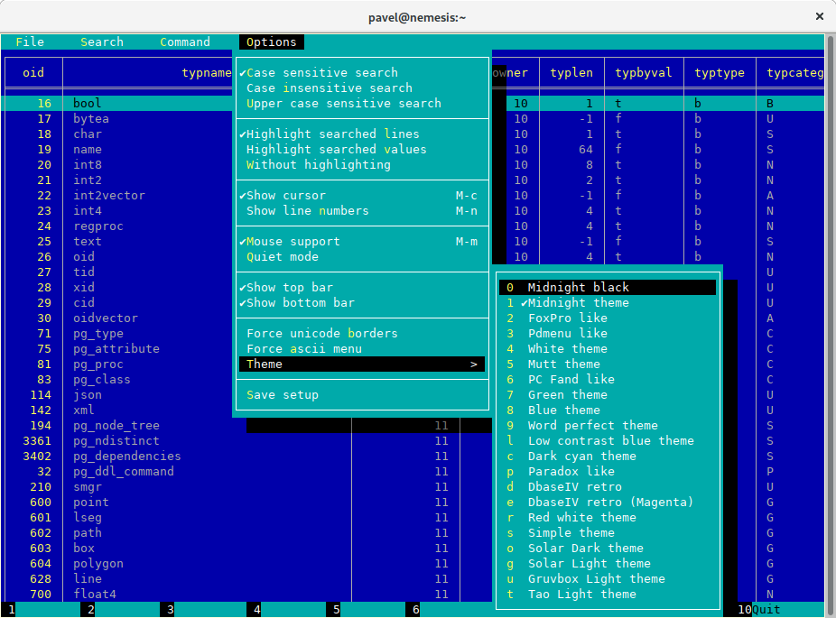
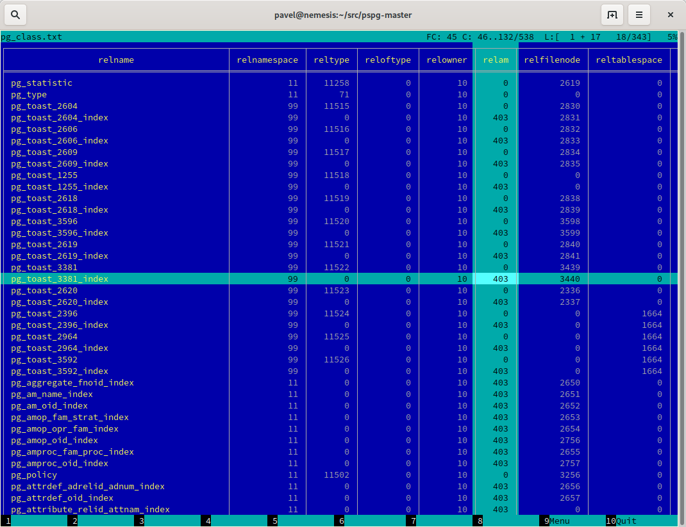
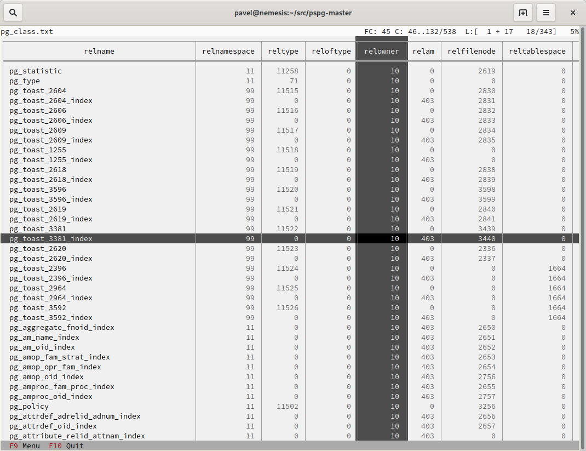
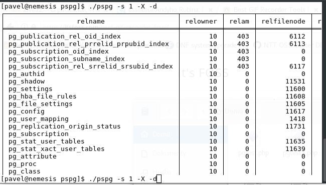
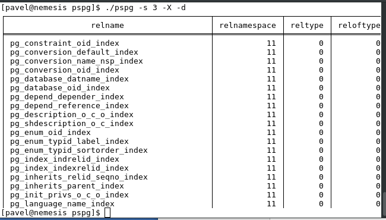

[](https://travis-ci.org/okbob/pspg)

# pspg - Postgres Pager
Everybody who uses `psql` uses `less` pager. It is working well, but there is not any special
support for tabular data. I found few projects, but no one was completed for this purpose.
I decided to write some small specialized pager for usage as `psql` pager.

This pager can be used from the following clients command line clients too:

- `mysql`
- `sqlite`
- [`pgcli`](https://github.com/dbcli/pgcli/)

## Main target
* possibility to freeze first few rows, first few columns
* possibility to sort data by specified numeric column
* possibility to use fancy colors - like `mcview` or `FoxPro` - http://okbob.blogspot.com/2019/12/pspg-themes-what-you-use-it.html


## Screenshots








## Options
* `-a`       menu will use ascii borders
* `-b`       black/white theme
* `-X`       doesn't clean screen on the end
* `-s N`     use theme (default theme is mc theme)
* `-c N`     freeze first N columns
* `-f file`  open file (default stdin)
* `--no-watch-file`  don't watch changes of file
* `--force-uniborder`  replace ascii border by unicode borders
* `-g --hilite-search`  don't highlight lines for searches
* `-G --HILITE-SEARCH`  don't highlight lines for searches ever
* `--help`   show this help
* `-i --ignore-case`  ignore case in searches that do not contain uppercase
* `-I --IGNORE-CASE`  ignore case in all searches
* `--less-status-bar`  status bar like less pager
* `--line-numbers`  show line number column
* `--no-mouse`  without own mouse handling (cannot be changed in app)
* `--no-sound`  without sound effect
* `-F`, `--quit-if-one-screen`  quit if content is one screen
* `-V`, `--version`  show version
* `--about`  show info about authors
* `--csv`  input format is csv
* `--tsv`  input format is tsv
* `--double-header`  header line is doubled
* `--border`  border used for formatted csv
* `--csv-separator`  special char used as separator inside csv documents
* `--null striing`  null string (default "")
* `--ni`  not interactive mode (format csv to table and quit)
* `--no-cursor`  the line cursor will be hidden
* `--no-commandbar`  the bottom bar will be hidden
* `--no-topbar`  the top bar will be hidden
* `--no-bars`  both bars will be hidden
* `--no-sigint-search-reset`  sigint is not used to reset searching
* `--tabular-cursor`  cursor is displayed only for table
* `--only-for-tables`  use std pager when content is not a table
* `--bold-labels`  bold font for row, column labels
* `--bold-cursor`  bold font for cursor
* `--vertical-cursor`  show column cursor
* `--on-sigint-exit`  double escape or ctrl c ending pager
* `--quit-on-f3`  exit on press F3 (like mc viewer)
* `--skip-colums-like`  space separated list of ignored columns (only for csv and tsv format)
* `-q`, `--query`  execute query
* `-w`, `--watch n`  repeat query execution every time sec
* `-d`, `--dbname`  database name
* `-h`, `--host`  database host name
* `-p`, `--port`  databae port
* `-U`, `--username`  database user name
* `-W`, `--password`  force password prompt

Options can be passed inside env variable `PSPG` too.

## Themes
0. black & white
1. Midnight Commander like
2. FoxPro like
3. Pdmenu like
4. White theme
5. Mutt like
6. PCFand like
7. Green theme
8. Blue theme
9. Word Perfect like
10. Low contrast blue theme
11. Dark cyan/black mode
12. Paradox like
13. dBase IV retro style
14. dBase IV retro style (Magenta labels)
15. Red white theme
16. Simple theme
17. Solarized dark theme 
18. Solarized light theme
19. Gruvbox light theme
20. Tao Light theme

see http://okbob.blogspot.cz/2017/07/i-hope-so-every-who-uses-psql-uses-less.html


## Keyboard commands
* <kbd>0</kbd>, <kbd>1</kbd>, <kbd>2</kbd>, <kbd>3</kbd>, .., <kbd>9</kbd> - freeze first N columns
* <kbd>KEY_UP</kbd>, <kbd>k</kbd> - navigate backward by one line
* <kbd>KEY_DOWN</kbd>, <kbd>j</kbd> - navigate forward by one line
* <kbd>KEY_LEFT</kbd>, <kbd>h</kbd> - scroll to left
* <kbd>KEY_RIGHT</kbd>, <kbd>l</kbd> - scroll to right
* <kbd>Ctrl</kbd>+<kbd>Home</kbd>, <kbd>g</kbd> - go to the start of file
* <kbd>Ctrl</kbd>+<kbd>End</kbd>, <kbd>G</kbd> - go to the end of file
* <kbd>Alt</kbd>+<kbd>l</kbd> - go to line number
* <kbd>H</kbd> - go to first line of current window
* <kbd>M</kbd> - go to half of current window
* <kbd>L</kbd> - go to end of current window
* <kbd>PPAGE</kbd>, <kbd>Ctrl</kbd>+<kbd>b</kbd> - backward one window
* <kbd>NPAGE</kbd>, <kbd>Ctrl</kbd>+<kbd>f</kbd>, <kbd>space</kbd> - forward one window
* <kbd>HOME</kbd>, <kbd>^</kbd> - go to begin of line, first column
* <kbd>END</kbd>, <kbd>$</kbd> - go to end of line, last column
* <kbd>Ctrl</kbd>+<kbd>e</kbd> - scroll a window down
* <kbd>Ctrl</kbd>+<kbd>y</kbd> - scroll a window up
* <kbd>Ctrl</kbd>+<kbd>d</kbd> - forward a half window
* <kbd>Ctrl</kbd>+<kbd>u</kbd> - backward a half window
* <kbd>s</kbd> - save content to file
* <kbd>/</kbd> - search for a pattern which will take you to the next occurrence
* <kbd>?</kbd> - search for a pattern which will take you to the previous occurrence
* <kbd>n</kbd> - for next match
* <kbd>N</kbd> - for next match in reverse direction
* <kbd>c</kbd> - column search
* <kbd>Alt</kbd>+<kbd>c</kbd> - switch (on, off) drawing line cursor
* <kbd>Alt</kbd>+<kbd>m</kbd> - switch (on, off) own mouse handler
* <kbd>Alt</kbd>+<kbd>n</kbd> - switch (on, off) drawing line numbers
* <kbd>Alt</kbd>+<kbd>v</kbd>, <kbd>double click</kbd> on column header - switch (on, off) drawing column cursor
* Mouse button wheel - scroll vertical
* <kbd>Alt</kbd>+<kbd>Mouse button wheel</kbd> - scroll horizontal
* <kbd>F9</kbd> - show menu
* <kbd>q</kbd>, <kbd>F10</kbd>, <kbd>Esc</kbd> <kbd>0</kbd> - quit
* <kbd>Alt</kbd>+<kbd>q</kbd> - quit wit raw (unformatted) output
* <kbd>Alt</kbd>+<kbd>k</kbd>, <kbd>Alt</kbd>+<kbd>double click</kbd> - switch bookmark
* <kbd>Alt</kbd>+<kbd>j</kbd> - go to next bookmark
* <kbd>Alt</kbd>+<kbd>i</kbd> - go to previous bookmark
* <kbd>Alt</kbd>+<kbd>o</kbd> - flush bookmarks
* <kbd>a</kbd> - sort ascendent
* <kbd>d</kbd> - sort descendent
* <kbd>u</kbd> - unsorted (sorted in origin order)
* <kbd>space</kbd> - stop/continue in watch mode
* <kbd>R</kbd> - Repaint screen and refresh input file

## Ending

The pager can be ended by pressing keys <kbd>q</kbd> or <kbd>F10</kbd> or <kbd>Esc</kbd> <kbd>0</kbd>.
With option `--on-sigint-exit` then the pager is closed by pressing keys <kbd>Ctrl</kbd>+<kbd>c</kbd>
or <kbd>Esc</kbd> <kbd>Esc</kbd>.

## Column search

Column search is case insensitive every time. Searched column is marked by vertical cursor.
Last non empty string searching pattern is used when current searching pattern is empty string.
Searching is starting after visible vertical column or on first visible not freezed columns (after
some horizontal scrolling) or on first column. After last column searching starts from first again.

## Status line description
* `V: [d/d d..d]` - vertical cursor: (column number)/(columns) (char possitions from) .. (char possitions to)
* `FC: d` - freezed columns length in chars
* `C: d..d/d` - unfreezed visible data in chars (from .. to)/(total)
* `L:[d + d  d/d]` - lines (number of first visible line) + (number of line of display), (current line)/(lines)
* `d%` - percent of already displayed data

# Usage as csv viewer

It works well with miller http://johnkerl.org/miller/doc/index.html
<pre>
mlr --icsv --opprint --barred put '' obce.csv | pspg --force-uniborder
</pre>

New version has integrated csv support - just use `--csv` option.

It can be integrated into <code>mc</code>

* copy file from `/etc/mc/mc.ext` to your `~/.config/mc directory`
* insert there

<pre>
#csv
regex/\.csv
    View=pspg -f %f --csv
</pre>

* restart <code>mc</code>

# Usage in watch mode

The result of query can be refreshed every n seconds. `pspg` remembers cursor row,
possible vertical cursor, possible ordering. The refreshing should be paused by pressing
<kbd>space</kbd> key. Repeated pressing of this key enables refreshing again.

`pspg` uses inotify API when it is available, and when input file is changed, then
`pspg` reread file immediately. This behave can be disabled by option `--no-watch-file`
or by specification watch time by option `--watch`.

# Special options for reading from stream (file or FIFO)

`pspg` can continually read from file or FIFO (named pipe). This behave should
should be forced by option `--stream`.

When last writer to FIFO is ending, then `pspg` is ending too. This behave can be
changed by option `--hold-stream`. Default value is 0. When `--hold-stream=1` then
`pspg` will try to reopen FIFO and will hang until the FIFO will be opened for
writing. `--hold-stream=2` is different strategy. The `pspg` reopen FIFO in write
mode, and then FIFO will be opened until `pspg` is running.

# Recommended psql configuration
<pre>
\pset linestyle unicode
\pset border 2
</pre>

some possible configuration:
<pre>
-- Switch pagers with :x and :xx commands
\set x '\\setenv PAGER less'
\set xx '\\setenv PAGER \'pspg -bX --no-mouse\''
:xx
</pre>

`LC_CTYPE` should be correct. Mainly when you use unicode borders.
ncurses doesn't display unicode borders (produced by `psql`) without
correct setting of this variable. Is possible to check a value 'C.UTF8'.

## Attention

When you use a option `--only-for-tables`, then

* set `PAGER` to `pspg` and `PSPG_PAGER` to `less` or
* set `PAGER` to `less` and `PSQL_PAGER` to `pspg`

# MySQL usage
<pre>
MariaDB [sakila]> pager pspg -s 14 -X --force-uniborder --quit-if-one-screen
PAGER set to 'pspg -s 14 -X --force-uniborder --quit-if-one-screen'
MariaDB [sakila]> select now();
MariaDB [sakila]> select * from nicer_but_slower_film_list limit 100;
</pre>


# SQLite

SQLite native client doesn't produce well formatted output, but can be forced
to generate CSV format - and this format is well readable for `pspg`

    sqlite3 -csv -header testdb.db 'select * from foo2' | pspg --csv --csv-header=on --double-header
    
# pgcli

[pgcli](https://github.com/dbcli/pgcli/) needs the following configuration options (`~/.config/pgcli/config`):

```
pager = /usr/bin/pspg --csv --rr=2 --quit-if-one-screen --ignore-case --csv-header on 
table_format = csv
```

# Note - compilation issue
Some linker issues can be fixed by:
<pre>
I changed 
gcc -lncursesw pager.c -o pspg -ggdb
to
gcc pager.c -o pspg -ggdb -lncursesw
</pre>

On some old systems a compilation fails with error
<pre>
/home/user/Src/pspg-0.6/src/pspg.c:2403: undefined reference to `set_escdelay`
</pre>
In this case comment line with function set_escdelay

# Note - Installation
When you compile code from source, run ./configure first. Sometimes ./autogen.sh first

If you would to display UTF-8 characters, then `pspg` should be linked with `ncursesw`
library. UTF-8 characters are displayed badly when library `ncursesw` is used. You can
see broken characters with incorrect locale setting too.

You can check wide chars support by `pspg --version`. Row `ncurses with wide char support`
is expected. Re-run `configure` with `--with-ncursesw` option. When this command fails check
if development package for ncuresesw library is installed.

## Homebrew (for Linux & MacOS)

    # brew install pspg

## Debian

    # apt-cache search pspg
    # apt-get install pspg

## Fedora (28 and later)

    # dnf install pspg
    
## RPM (CentOS/openSUSE/…)
The pspg is available from community repository https://yum.postgresql.org/packages.php

## Alpine Linux

    # apk add pspg

## Gentoo

    # emerge -av dev-db/pspg

## Arch Linux

The Arch User Repository contains two versions:

* [pspg](https://aur.archlinux.org/packages/pspg/) is a fixed release.
* [pspg-git](https://aur.archlinux.org/packages/pspg-git/) tracks the `master` branch.

Use the AUR helper of your choice or git and `makepkg` to install pspg.

## FreeBSD

    # pkg install pspg


## Using MacPorts (MacOS only)

    # port install pspg


## Solaris

There are few issues requires manual code changes for successful compilation - we successfully
tested `pspg`, but although `pspg` was linked with ncursesw libraries, the utf8 encoding support
didn't work fully correctly - probably due some issues in `libc` library. There are problems with
chars encoded to 3bytes - unicode borders, .. Two bytes unicode chars should be displayed well.

You can use `pspg` with usual accented chars, but unicode bordes should not be used. Replacement
ascii borders by special borders chars (by ncurses technology) works well - looks on `Options|Force unicode borders`
option.

* Solaris `make` doesn't support conditional statements - should be removed So, remove unsupported
  functionality from `Makefile` (`ifdef`,`endif`), replace `-include` by `include` first.

* After running `configure` remove link on `termcap` library from `config.make`. It is garabage
  produced by `readline` automake script. Combination with `ncurses` libraries makes some
  linking issues.

### builtin libraries

    export CURSES_CFLAGS="-I/usr/include/ncurses/"
    export PANEL_LIBS="-lpanelw"
    ./configure

### OpenCSW development

    export CFLAGS="-m64 -I/opt/csw/include"
    export LDFLAGS="-L/opt/csw/lib/64 -R/opt/csw/lib/64"
    export PKG_CONFIG_PATH="/opt/csw/lib/64/pkgconfig"
    ./configure

# Possible ToDo

* Store data in some column format (now data are stored like array of rows). With this change can
  be possible to operate over columns - hide columns, change width, cyclic iteration over columns,
  change order of columns, mark columns and export only selected columns (selected rows).

# st_menu

This project uses st_menu library - implementation of CUA menubar and pulldown menu for ncurses
https://github.com/okbob/ncurses-st-menu

# Note

If you like it, send a postcard from your home country to my address, please:

    Pavel Stehule
    Skalice 12
    256 01 Benesov u Prahy
    Czech Republic


I invite any questions, comments, bug reports, patches on mail address pavel.stehule@gmail.com
