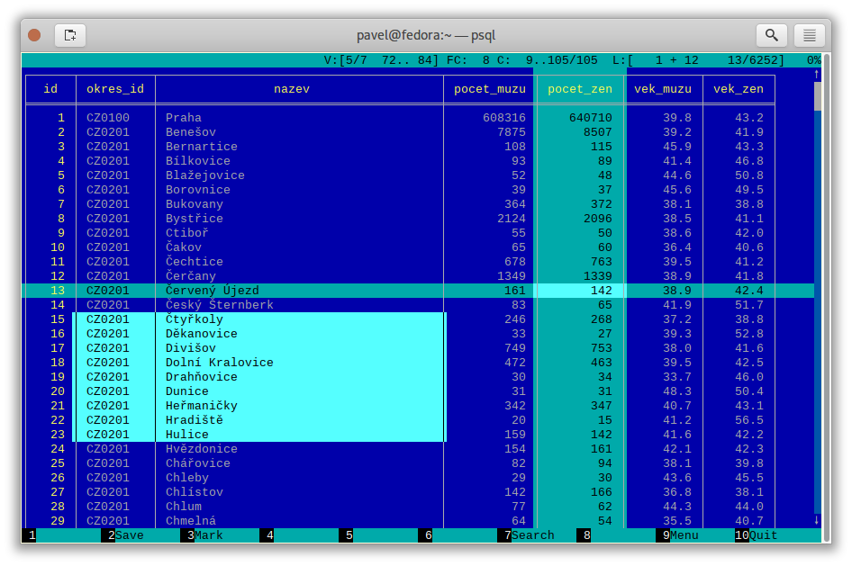
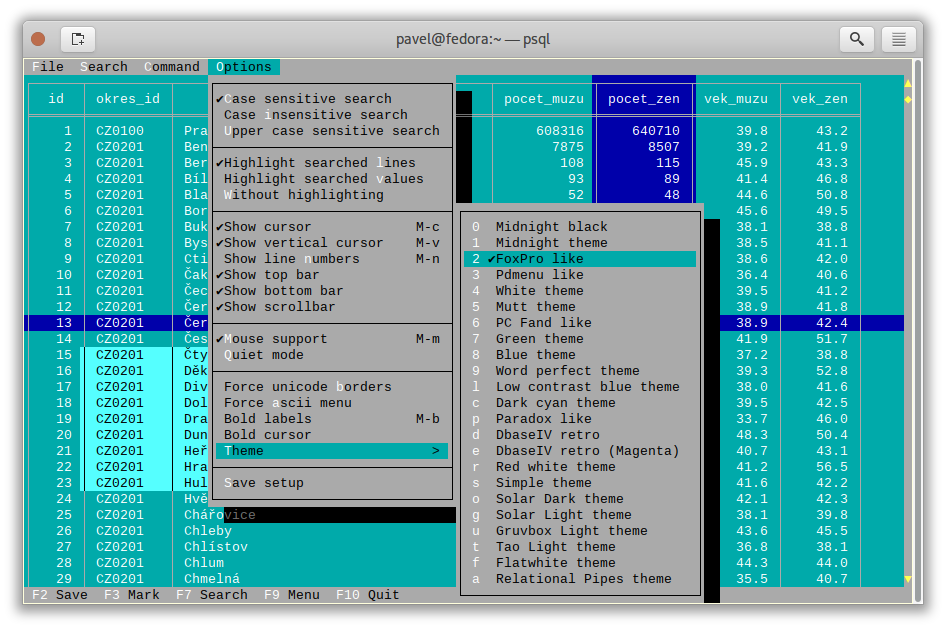
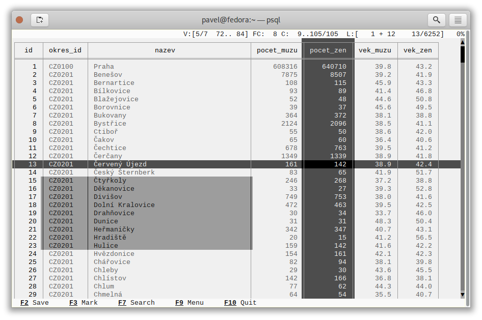
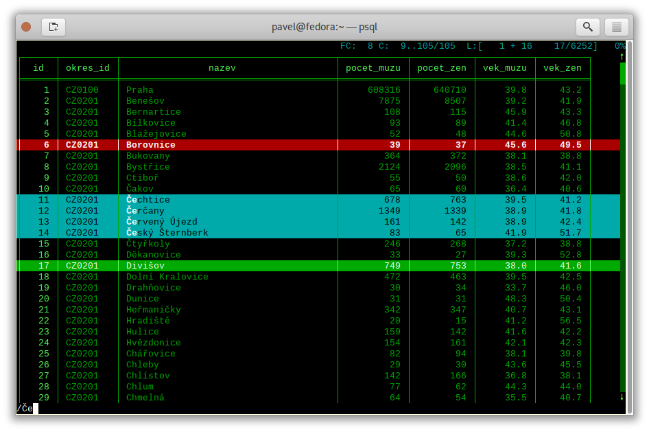

[](https://travis-ci.org/okbob/pspg)

# pspg - Postgres Pager

Everybody who uses `psql` uses `less` pager. It is working well, but there is not any special
support for tabular data. I found few projects, but no one was completed for this purpose.
I decided to write some small specialized pager for usage as `psql` pager.

This pager can be used from the following clients command line clients too:

- `mysql`
- `sqlite`
- [`pgcli`](https://github.com/dbcli/pgcli/)
- `monetdb`
- [`Trino (formerly Presto SQL)`](https://trino.io/)
- [`usql`](https://github.com/xo/usql/)


## Main target

* possibility to freeze first few rows, first few columns
* possibility to sort data by specified numeric column
* possibility to use fancy colors - like `mcview` or `FoxPro` - http://okbob.blogspot.com/2019/12/pspg-themes-what-you-use-it.html
* mouse is supported and used
* possibility to copy selected range to clipboard


## Video presentation

[](https://www.youtube.com/watch?v=JyxuEkoYDQk)


## Screenshots








## Options
```
[pavel@localhost ~]$ pspg --help
pspg is a Unix pager designed for table browsing.

Usage:
  pspg [OPTION] [file]

General options:
  --about                  about authors
  --help                   show this help
  -V, --version            show version
  -f, --file=FILE          open file
  -F, --quit-if-one-screen
                           quit if content is one screen
  --clipboard-app=NUM      specify app used by copy to clipboard (1, 2, 3)
  --hold-stream=NUM        can reopen closed FIFO (0, 1, 2)
  --interactive            force interactive mode
  --ignore_file_suffix     don't try to deduce format from file suffix
  --ni                     not interactive mode (only for csv and query)
  --no-watch-file          don't watch inotify event of file
  --no-mouse               don't use own mouse handling
  --no-sigint-search-reset
                           without reset searching on sigint (CTRL C)
  --no-sleep               without waits against flickering
  --no_xterm_mouse_mode    don't use optional xterm mouse mode
  --only-for-tables        use std pager when content is not table
  --on-sigint-exit         exit on sigint(CTRL C or Escape)
  --pgcli-fix              try to fix some pgcli related issues
  --querystream            read queries from stream forever
  --quit-on-f3             exit on F3 like mc viewers
  --rr=ROWNUM              rows reserved for specific purposes
  --stream                 read input forever
  -X, --reprint-on-exit    preserve content after exit

Output format options:
  -a, --ascii              force ascii
  -b, --blackwhite         black-white style
  -s, --style=N            set color style number (0..22)
  --bold-labels            row, column labels use bold font
  --bold-cursor            cursor use bold font
  --border                 type of borders (0..2)
  --double-header          header separator uses double lines
  --force-uniborder        replace ascii borders by unicode borders
  --ignore-bad-rows        rows with wrong column numbers are ignored
  --null=STRING            STRING used instead NULL

Searching options
  -g --hlite-search, -G --HILITE-SEARCH
                           don't highlight lines for searches
  -i --ignore-case         ignore case in searches that do not contain uppercase
  -I --IGNORE-CASE         ignore case in all searches

Interface options:
  -c, --freezecols=N       freeze N columns (0..9)
  --less-status-bar        status bar like less pager
  --line-numbers           show line number column
  --menu-always            show top bar menu every time
  --no-bars, --no-commandbar, --no-topbar
                           don't show bottom, top bar or both
  --no-cursor              row cursor will be hidden
  --no-scrollbar           don't show scrollbar
  --no-sound               don't use beep when scroll is not possible
  --tabular-cursor         cursor is visible only when data has table format
  --vertical-cursor        show vertical column cursor

Input format options:
  --csv                    input stream has csv format
  --csv-separator          char used as field separator
  --csv-header [on/off]    specify header line usage
  --skip-columns-like="SPACE SEPARATED STRING LIST"
                           columns with substr in name are ignored
  --tsv                    input stream has tsv format

Watch mode options:
  -q, --query=QUERY        execute query
  -w, --watch time         the query (or read file) is repeated every time (sec)

Connection options
  -d, --dbname=DBNAME      database name
  -h, --host=HOSTNAME      database server host (default: "local socket")
  -p, --port=PORT          database server port (default: "5432")
  -U, --username=USERNAME  database user name
  -W, --password           force password prompt

Debug options:
  --log=FILE               log debug info to file
  --wait=NUM               wait NUM seconds to allow attach from a debugger

pspg shares lot of key commands with less pager or vi editor.
```
Options can be passed inside env variable `PSPG` too.


## Environment variables

| Name          | Usage                                     |
|---------------|-------------------------------------------|
|`PSPG`         | can holds same options like command line  |
|`PSPG_CONF`    | path to configuration file                |
|`PSPG_HISTORY` | path to file pspg's readline history file |


## Themes

|Code| Name                                  |
|---:|---------------------------------------|
|  0 | black & white                         |
|  1 | Midnight Commander like               |
|  2 | FoxPro like                           |
|  3 | Pdmenu like                           |
|  4 | White theme                           |
|  5 | Mutt like                             |
|  6 | PCFand like                           |
|  7 | Green theme                           |
|  8 | Blue theme                            |
|  9 | Word Perfect like                     |
| 10 | Low contrast blue theme               |
| 11 | Dark cyan/black mode                  |
| 12 | Paradox like                          |
| 13 | dBase IV retro style                  |
| 14 | dBase IV retro style (Magenta labels) |
| 15 | Red white theme                       |
| 16 | Simple theme                          |
| 17 | Solarized dark theme                  | 
| 18 | Solarized light theme                 |
| 19 | Gruvbox light theme                   |
| 20 | Tao Light theme                       |
| 21 | FlatWhite theme                       |
| 22 | Relational pipes theme                |

see http://okbob.blogspot.cz/2017/07/i-hope-so-every-who-uses-psql-uses-less.html


## Keyboard commands

| Key(s)                                                                   | Command                                                             |
|--------------------------------------------------------------------------|---------------------------------------------------------------------|
| <kbd>0</kbd>, <kbd>1</kbd>, <kbd>2</kbd>, <kbd>3</kbd>, .., <kbd>9</kbd> | freeze first N columns                                              |
| <kbd>KEY_UP</kbd>, <kbd>k</kbd>                                          | navigate backward by one line                                       |
| <kbd>KEY_DOWN</kbd>, <kbd>j</kbd>                                        | navigate forward by one line                                        |
| <kbd>KEY_LEFT</kbd>, <kbd>h</kbd>                                        | scroll to left                                                      |
| <kbd>KEY_RIGHT</kbd>, <kbd>l</kbd>                                       | scroll to right                                                     |
| <kbd>Ctrl</kbd>+<kbd>Home</kbd>, <kbd>g</kbd>                            | go to the start of file                                             |
| <kbd>Ctrl</kbd>+<kbd>End</kbd>, <kbd>G</kbd>                             | go to the end of file                                               |
| <kbd>Alt</kbd>+<kbd>l</kbd>                                              | go to line number                                                   |
| <kbd>H</kbd>                                                             | go to first line of current window                                  |
| <kbd>M</kbd>                                                             | go to half of current window                                        |
| <kbd>L</kbd>                                                             | go to end of current window                                         |
| <kbd>PPAGE</kbd>, <kbd>Ctrl</kbd>+<kbd>b</kbd>                           | backward one window                                                 |
| <kbd>NPAGE</kbd>, <kbd>Ctrl</kbd>+<kbd>f</kbd>, <kbd>space</kbd>         | forward one window                                                  |
| <kbd>HOME</kbd>, <kbd>^</kbd>                                            | go to begin of line, first column                                   |
| <kbd>END</kbd>, <kbd>$</kbd>                                             | go to end of line, last column                                      |
| <kbd>Ctrl</kbd>+<kbd>e</kbd>                                             | scroll a window down                                                |
| <kbd>Ctrl</kbd>+<kbd>y</kbd>                                             | scroll a window up                                                  |
| <kbd>Ctrl</kbd>+<kbd>d</kbd>                                             | forward a half window                                               |                                                                                                                                                                                                                                                                                                            
| <kbd>Ctrl</kbd>+<kbd>u</kbd>                                             | backward a half window                                              |
| <kbd>s</kbd>                                                             | save content to file                                                |
| <kbd>/</kbd>                                                             | search for a pattern which will take you to the next occurrence     |
| <kbd>?</kbd>                                                             | search for a pattern which will take you to the previous occurrence |
| <kbd>n</kbd>                                                             | for next match                                                      |
| <kbd>N</kbd>                                                             | for next match in reverse direction                                 |
| <kbd>c</kbd>                                                             | column search                                                       |
| <kbd>Alt</kbd>+<kbd>c</kbd>                                              | switch (on, off) drawing line cursor                                |
| <kbd>Alt</kbd>+<kbd>m</kbd>                                              | switch (on, off) own mouse handler                                  |
| <kbd>Alt</kbd>+<kbd>n</kbd>                                              | switch (on, off) drawing line numbers                               |
| <kbd>Alt</kbd>+<kbd>v</kbd>, <kbd>double click</kbd> on column header    | switch (on, off) drawing column cursor                              |
| <kbd>Mouse button wheel</kbd>                                            | scroll vertical                                                     |
| <kbd>Alt</kbd>+<kbd>Mouse button wheel</kbd>                             | scroll horizontal                                                   |
| <kbd>F9</kbd>                                                            | show menu                                                           |
| <kbd>q</kbd>, <kbd>F10</kbd>, <kbd>Esc</kbd> <kbd>0</kbd>                | quit                                                                |
| <kbd>Alt</kbd>+<kbd>q</kbd>                                              | quit and print raw (unformatted) content                            |
| <kbd>Alt</kbd>+<kbd>k</kbd>, <kbd>Alt</kbd>+<kbd>double click</kbd>      | switch bookmark                                                     |
| <kbd>Alt</kbd>+<kbd>j</kbd>                                              | go to next bookmark                                                 |
| <kbd>Alt</kbd>+<kbd>i</kbd>                                              | go to previous bookmark                                             |
| <kbd>Alt</kbd>+<kbd>o</kbd>                                              | flush bookmarks                                                     |
| <kbd>a</kbd>                                                             | sort ascendent                                                      |
| <kbd>d</kbd>                                                             | sort descendent                                                     |
| <kbd>u</kbd>                                                             | unsorted (sorted in origin order)                                   |
| <kbd>space</kbd>                                                         | stop/continue in watch mode                                         |
| <kbd>R</kbd>                                                             | Repaint screen and refresh input file                               |
| <kbd>Ins</kbd>                                                           | export row, column or cell to default target                        |
| <kbd>shift</kbd>+<kbd>cursor...</kbd>                                    | define range                                                        |
| <kbd>F3</kbd>                                                            | start/finish of selection rows                                      |
| <kbd>shift</kbd>+<kbd>F3</kbd>                                           | start/finish of selection block                                     |
| <kbd>Ctrl</kbd> + <kbd>drag mouse</kbd>                                  | defines rows selection, on column header defines column selection   |


## Backslash commands
| Command                                      | Description                |
|----------------------------------------------|----------------------------|
| `\[+]N`                                      | go to line number          |
| `\-N`                                        | go to line number from end |
| `\N+`                                        | go to N lines forward      |
| `\N-`                                        | go to N lines backward     |
| `\theme N`                                   | set theme number           |
| `\copy [all|selected] [csv|tsv|insert|text]` | copy data to clipboard     |
| `\save [all|selected] [csv|tsv|insert|text]` | copy data to clipboard     |
| `\order [N|colum name]`                      | sort by colum              |
| `\orderd [N|colum name]`                     | desc sort by column        |


## Ending

The pager can be ended by pressing keys <kbd>q</kbd> or <kbd>F10</kbd> or <kbd>Esc</kbd> <kbd>0</kbd>.
With option `--on-sigint-exit` then the pager is closed by pressing keys <kbd>Ctrl</kbd>+<kbd>c</kbd>
or <kbd>Esc</kbd> <kbd>Esc</kbd>.


## Column search

Column search is case insensitive every time. Searched column is marked by vertical cursor.
Last non empty string searching pattern is used when current searching pattern is empty string.
Searching is starting after visible vertical column or on first visible not freezed columns (after
some horizontal scrolling) or on first column. After last column searching starts from first again.


# Export & Clipboard

For clipboard support the clipboard application should be installed: 1. wl-clipboard (Wayland),
2. xlip (xwindows) or 3. pbcopy (MacOS).

`pspg` try to translate unicode symbol '∅' to NULL every time. If you don't use special setting
by `\pset null ...`, then `psql` displays empty string instead NULL. `pspg` hasn't any special
detection (in export routines) for this case. You should to check and enable or disable menu
item `Empty string is NULL`.

`pspg` has automatic detection of clipboard application. Unfortunatelly, this detection should
not to work for same cases. You can specify the application by specify number (1,2,3) to
`--clipboard-app` option.


# Status line description

* `V: [d/d d..d]` - vertical cursor: (column number)/(columns) (char possitions from) .. (char possitions to)
* `FC: d` - freezed columns length in chars
* `C: d..d/d` - unfreezed visible data in chars (from .. to)/(total)
* `L:[d + d  d/d]` - lines (number of first visible line) + (number of line of display), (current line)/(lines)
* `d%` - percent of already displayed data


# Usage as csv viewer

It works well with miller http://johnkerl.org/miller/doc/index.html
<pre>
mlr --icsv --opprint --barred put '' obce.csv | pspg --force-uniborder
</pre>

New version has integrated csv support - just use `--csv` option.

It can be integrated into <code>mc</code>

* copy file from `/etc/mc/mc.ext` to your `~/.config/mc directory`
* insert there

<pre>


#csv

regex/\.csv
    View=pspg -f %f --csv
</pre>

* restart <code>mc</code>


# Know issues

* When you use `pspg` on Cygwin, then some temporary freezing of scrolling was reported
  In this case, please, use an option `--no-sleep`. I see slow scrolling (via scrollbar)
  inside konsole (KDE terminal). The option `--no-sleep` helps too.


# Usage in watch mode

The result of query can be refreshed every n seconds. `pspg` remembers cursor row,
possible vertical cursor, possible ordering. The refreshing should be paused by pressing
<kbd>space</kbd> key. Repeated pressing of this key enables refreshing again.

`pspg` uses inotify API when it is available, and when input file is changed, then
`pspg` reread file immediately. This behave can be disabled by option `--no-watch-file`
or by specification watch time by option `--watch`.


# Special options for reading from stream (file or FIFO)

`pspg` can continually read from file or FIFO (named pipe). This behave should
should be forced by option `--stream`.

When last writer to FIFO is ending, then `pspg` is ending too. This behave can be
changed by option `--hold-stream`. Default value is 0. When `--hold-stream=1` then
`pspg` will try to reopen FIFO and will hang until the FIFO will be opened for
writing. `--hold-stream=2` is different strategy. The `pspg` reopen FIFO in write
mode, and then FIFO will be opened until `pspg` is running.


# Streaming modes

`pspg` can read a stream of tabular data from pipe or from file (with an option
`--stream` or it can read a stream of queries from pipe or from file (with an
option `--querystream`). It is good to use these option with option `--hold-stream`.

Without this option, there are possible unwanted issues when pipe will be closed.

The query stream mode is an sequence of SQL statements separated by char GS (Group
separator - 0x1D on separated line.


# Recommended psql configuration

you should to add to your profile:
<pre>
#for Postgres 10 and older
export PAGER="pspg"

#for postgres 11 and newer
export PSQL_PAGER="pspg"

#or "\setenv PAGER pspg" to .psqlrc
</pre>

and <code>.psqlrc</code>

<pre>
\set QUIET 1
\pset linestyle unicode
\pset border 2
\pset null ∅
\unset QUIET
</pre>

some possible configuration:
<pre>
-- Switch pagers with :x and :xx commands
\set x '\\setenv PAGER less'
\set xx '\\setenv PAGER \'pspg -bX --no-mouse\''
:xx
</pre>

`LC_CTYPE` should be correct. Mainly when you use unicode borders.
ncurses doesn't display unicode borders (produced by `psql`) without
correct setting of this variable. Is possible to check a value 'C.UTF8'.


## Attention

When you use a option `--only-for-tables`, then

* set `PAGER` to `pspg` and `PSQL_PAGER` to `less` or
* set `PAGER` to `less` and `PSQL_PAGER` to `pspg`


# MySQL usage

<pre>
MariaDB [sakila]> pager pspg -s 14 -X --force-uniborder --quit-if-one-screen
PAGER set to 'pspg -s 14 -X --force-uniborder --quit-if-one-screen'
MariaDB [sakila]> select now();
MariaDB [sakila]> select * from nicer_but_slower_film_list limit 100;
</pre>


# SQLite

SQLite native client doesn't produce well formatted output, but can be forced
to generate CSV format - and this format is well readable for `pspg`

    sqlite3 -csv -header testdb.db 'select * from foo2' | pspg --csv --csv-header=on --double-header
    


# pgcli

[pgcli](https://github.com/dbcli/pgcli/) needs the following configuration options (`~/.config/pgcli/config`):

```
pager = /usr/bin/pspg --csv --rr=2 --quit-if-one-screen --ignore-case --csv-header on --pgcli-fix
table_format = csv
```

# Note - mouse

pspg try to use xterm mouse mode 1002, when terminal and ncurses are not too antique. If there
are problems with usage - unwanted visual artefacts when you move with mouse when some mouse
button is pressed, then 1. please, report issue (please, attach log file), 2. use an option
`--no-xterm-mouse-mode` and `pspg` will not try to activate this mode.


# Note - compilation issue

Some linker issues can be fixed by:
<pre>
I changed 
gcc -lncursesw pager.c -o pspg -ggdb
to
gcc pager.c -o pspg -ggdb -lncursesw
</pre>

On some old systems a compilation fails with error
<pre>
/home/user/Src/pspg-0.6/src/pspg.c:2403: undefined reference to `set_escdelay`
</pre>
In this case comment line with function set_escdelay

If you want to use `pspg` as Postgres client, then you need run
`configure --with-postgres=yes`. On Fedora with own Postgres build
I had to install `openssl-devel` package and I had to set
`export PKG_CONFIG_PATH="/usr/local/pgsql/master/lib/pkgconfig/"`.


# Note - Installation

When you compile code from source, run ./configure first. Sometimes ./autogen.sh first

If you would to display UTF-8 characters, then `pspg` should be linked with `ncursesw`
library. UTF-8 characters are displayed badly when library `ncursesw` is used. You can
see broken characters with incorrect locale setting too.

You can check wide chars support by `pspg --version`. Row `ncurses with wide char support`
is expected. Re-run `configure` with `--with-ncursesw` option. When this command fails check
if development package for ncuresesw library is installed.


## Homebrew (for Linux & MacOS)

    # brew install pspg


## Debian

    # apt-cache search pspg
    # apt-get install pspg


## Fedora (28 and later)

    # dnf install pspg
    

## RPM (CentOS/openSUSE/…)
The pspg is available from community repository https://yum.postgresql.org/packages.php


## Alpine Linux

    # apk add pspg


## Gentoo

    # emerge -av dev-db/pspg


## Arch Linux

The Arch User Repository contains two versions:

* [pspg](https://aur.archlinux.org/packages/pspg/) is a fixed release.
* [pspg-git](https://aur.archlinux.org/packages/pspg-git/) tracks the `master` branch.

Use the AUR helper of your choice or git and `makepkg` to install pspg.


## FreeBSD

    # pkg install pspg


## Using MacPorts (MacOS only)

    # port install pspg


## Solaris

There are few issues requires manual code changes for successful compilation - we successfully
tested `pspg`, but although `pspg` was linked with ncursesw libraries, the utf8 encoding support
didn't work fully correctly - probably due some issues in `libc` library. There are problems with
chars encoded to 3bytes - unicode borders, .. Two bytes unicode chars should be displayed well.

You can use `pspg` with usual accented chars, but unicode bordes should not be used. Replacement
ascii borders by special borders chars (by ncurses technology) works well - looks on `Options|Force unicode borders`
option.

* Solaris `make` doesn't support conditional statements - should be removed So, remove unsupported
  functionality from `Makefile` (`ifdef`,`endif`), replace `-include` by `include` first.

* After running `configure` remove link on `termcap` library from `config.make`. It is garabage
  produced by `readline` automake script. Combination with `ncurses` libraries makes some
  linking issues.


### builtin libraries

    export CURSES_CFLAGS="-I/usr/include/ncurses/"
    export PANEL_LIBS="-lpanelw"
    ./configure


### OpenCSW development

    export CFLAGS="-m64 -I/opt/csw/include"
    export LDFLAGS="-L/opt/csw/lib/64 -R/opt/csw/lib/64"
    export PKG_CONFIG_PATH="/opt/csw/lib/64/pkgconfig"
    ./configure


# Possible ToDo

* Store data in some column format (now data are stored like array of rows). With this change can
  be possible to operate over columns - hide columns, change width, cyclic iteration over columns,
  change order of columns, mark columns and export only selected columns (selected rows).


# st_menu

This project uses st_menu library - implementation of CUA menubar and pulldown menu for ncurses
https://github.com/okbob/ncurses-st-menu


# Note

If you like it, send a postcard from your home country to my address, please:

    Pavel Stehule
    Skalice 12
    256 01 Benesov u Prahy
    Czech Republic


I invite any questions, comments, bug reports, patches on mail address pavel.stehule@gmail.com
